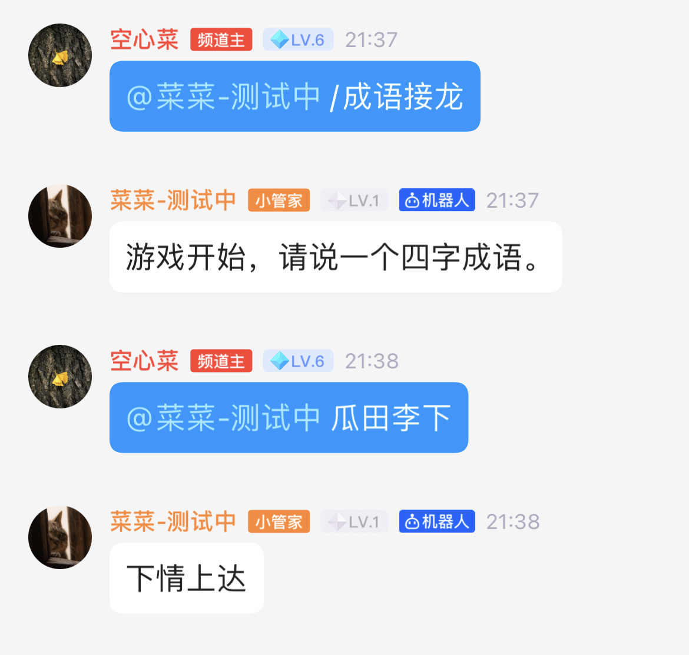
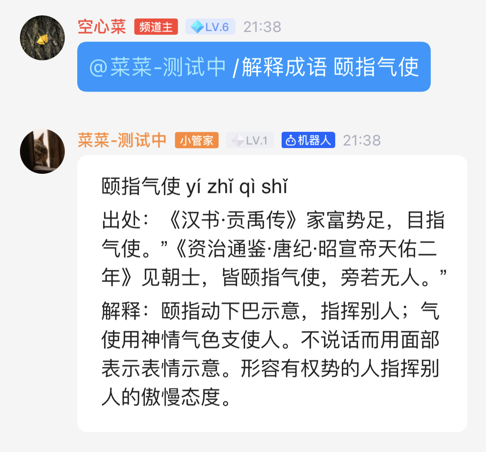

# QQ频道机器人（菜菜）

## 功能
> 成语接龙、成语详情查询

## 使用方法
```go
go run man.go
```

## 手机客户端操作

目前一共实现了三种接口：
- /成语接龙
- /认输 
- /解释成语 xxxx


### /成语接龙 （启动游戏）


@机器人并且输入“/成语接龙”关键词将触发启动游戏，游戏过程中通过@机器人发送消息的方式来进行回复，当客户端超过一定的时间没有相应或者词库已经没有合适的词语进行下去时，游戏会被迫自动结束。可以主动输入“/认输”指令结束游戏。

### /认输 （结束游戏）


### /解释成语 xxxx
客户端可以主动向机器人询问某个成语的意思，如使用“/解释成语 颐指气使"，菜菜机器人会对输入进行合法性检测，如果是正确的成语，会将该成语的出处和解释通过消息进行推送。



